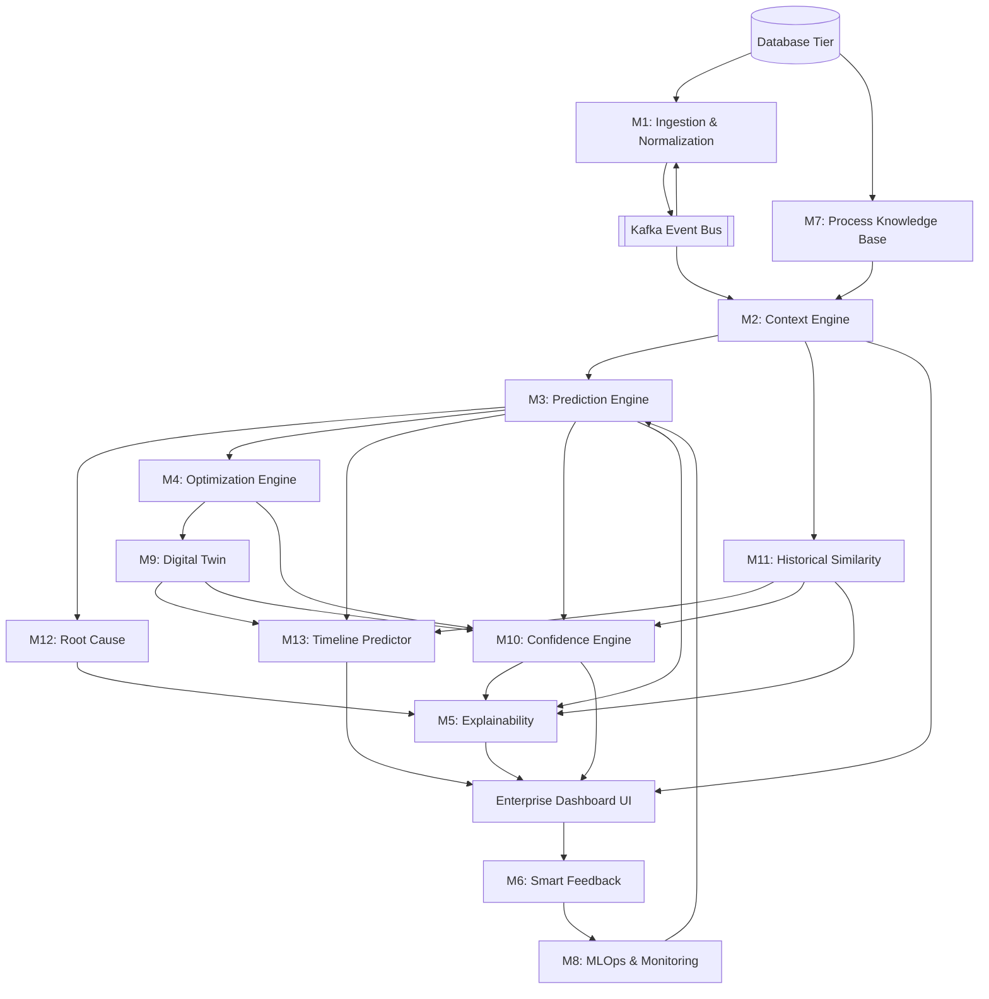

# Implementation Blueprint — GradeChange Intelligence Platform

**Document ID:** HPS-GCI-IMPL-001
**Version:** 1.0
**Phase:** Pre-Implementation Planning

This blueprint defines the step-by-step implementation plan for backend, frontend, AI services, and infrastructure to minimize rework and respect architectural dependencies.

---

## 1. Module Dependency Graph

---

## 2. Module Implementation Specifications

### M7: Process Knowledge Base (The Foundation)
- **Order:** 1
- **Dependencies:** None
- **Complexity:** Low (CRUD service)
- **APIs:** None (Internal DB access only in Phase 1)
- **DB Tables:** `cfg_process_variables`, `cfg_grades`, `cfg_grade_recipes`, `cfg_process_constraints`
- **Libraries:** SQLAlchemy/GORM (if Go), psycopg2
- **Inputs:** Static config files / Admin UI updates
- **Outputs:** Structured recipe and constraint data
- **Unit Test:** Verify recipe versioning logic; constraint boundary logic.
- **Integration Test:** Database connection resilience; rapid bulk read tests.

### M1: Data Ingestion & Normalization
- **Order:** 2
- **Dependencies:** M7 (for variable definitions)
- **Complexity:** High (High throughput, real-time)
- **APIs:** `ingestion.proto`
- **DB Tables:** `ops_sensor_data`, `ops_feature_vectors`, `alert_alarms`
- **Libraries:** confluent-kafka, redis-py, scikit-learn (Isolation Forest)
- **Inputs:** OPC-UA streams, Historian REST APIs
- **Outputs:** Normalized feature vectors to Kafka `gci.features`
- **Unit Test:** Imputation logic accuracy; z-score normalization correctness.
- **Integration Test:** End-to-end throughput test (500 msg/sec); Kafka dead-letter routing.

### M2: Grade Change Context Engine
- **Order:** 3
- **Dependencies:** M1, M7
- **Complexity:** Medium (State machine logic)
- **APIs:** `context.proto`
- **DB Tables:** `ops_grade_change_sessions`, `ops_transition_phases`
- **Libraries:** transitions (Python state machine)
- **Inputs:** `gci.features` (Kafka), M7 Recipe data
- **Outputs:** Context object to Kafka `gci.context`
- **Unit Test:** State transition enforcement (INITIATED → RAMPING); invalid transition rejection.
- **Integration Test:** Simulate DCS step-change and verify context generation within 100ms.

### M3: Prediction Engine
- **Order:** 4
- **Dependencies:** M2
- **Complexity:** High (Deep learning inference)
- **APIs:** `prediction.proto`
- **DB Tables:** `ai_predictions`, `ai_prediction_horizons`
- **Libraries:** PyTorch, ONNX Runtime
- **Inputs:** `gci.features`, `gci.context`
- **Outputs:** Trajectory forecast to Kafka `gci.predictions`
- **Unit Test:** Tensor shape validation; conformal interval bound sanity checks.
- **Integration Test:** Inference latency < 200ms at p95 under load.

### M12: Root Cause Ranking Engine
- **Order:** 5
- **Dependencies:** M3
- **Complexity:** Medium
- **APIs:** `root-cause.proto`
- **DB Tables:** `ai_root_cause_reports`, `ai_root_cause_factors`
- **Libraries:** shap, numpy
- **Inputs:** M3 prediction tensors, M7 Engineering Rules
- **Outputs:** Ranked factors to Kafka `gci.root-cause`
- **Unit Test:** SHAP value normalization (sum to 100%); actionability tagging logic.
- **Integration Test:** Output consistency with M3 prediction magnitudes.

### M11: Historical Similarity Engine
- **Order:** 6
- **Dependencies:** M2
- **Complexity:** High (O(N) search optimization)
- **APIs:** `similarity.proto`
- **DB Tables:** `ai_similarity_reports`, `ai_historical_matches`
- **Libraries:** tslearn, fastdtw
- **Inputs:** Transition start event (M2), target grade
- **Outputs:** Top-K matches to Kafka `gci.similarity`
- **Unit Test:** DTW distance calculation correctness on synthetic time-series.
- **Integration Test:** Sub-500ms retrieval against 10,000 historical records.

### M4: Optimization Engine
- **Order:** 7
- **Dependencies:** M3, M7
- **Complexity:** High (Multi-objective optimization)
- **APIs:** `optimization.proto`
- **DB Tables:** `ai_recommendations`, `ai_recommendation_setpoints`
- **Libraries:** pymoo (NSGA-III)
- **Inputs:** `gci.predictions` (WARNING state), M7 constraints
- **Outputs:** Setpoint changes to Kafka `gci.recommendations`
- **Unit Test:** Pareto front generation; hard constraint violation rejection.
- **Integration Test:** Verify optimization converges within 2-second timeout.

### M9: Digital Twin Simulator
- **Order:** 8
- **Dependencies:** M4
- **Complexity:** High (Neural ODE inference)
- **APIs:** `digital-twin.proto`
- **DB Tables:** `ai_simulations`, `ai_simulation_trajectories`
- **Libraries:** torchdiffeq
- **Inputs:** `gci.recommendations` (for validation), User RPC requests
- **Outputs:** Simulated trajectories
- **Unit Test:** ODE solver stability on edge-case inputs.
- **Integration Test:** Compare simulated trajectory to M3 baseline for structural similarity.

### M13: Timeline Predictor
- **Order:** 9
- **Dependencies:** M3, M9, M11
- **Complexity:** Medium
- **APIs:** `timeline.proto`
- **DB Tables:** `ai_timeline_predictions`, `ai_timeline_phases`
- **Libraries:** lifelines (survival analysis)
- **Inputs:** Predictions, Simulations, Similarity outcomes
- **Outputs:** Phase schedule to Kafka `gci.timeline`
- **Unit Test:** Fusion logic weighting correctly degrades if M9 is unavailable.
- **Integration Test:** Accuracy of time-remaining metric against historical test set.

### M10: Confidence Engine
- **Order:** 10
- **Dependencies:** M3, M4, M9, M11
- **Complexity:** Low (Aggregation logic)
- **APIs:** `confidence.proto`
- **DB Tables:** `ai_confidence_scores`
- **Libraries:** numpy
- **Inputs:** M3, M4, M9, M11 confidence metrics
- **Outputs:** Composite score to Kafka `gci.confidence`
- **Unit Test:** Weighted average logic; bounding logic (0.0 to 1.0).
- **Integration Test:** Ensure fallback logic executes if 1 of 4 inputs is missing.

### M5: Explainability Service
- **Order:** 11
- **Dependencies:** M10, M11, M12
- **Complexity:** Medium (Template generation)
- **APIs:** `explainability.proto`
- **DB Tables:** None (Stateless)
- **Libraries:** Jinja2
- **Inputs:** Root causes, similarity, confidence, recommendation
- **Outputs:** Natural language JSON payload to UI
- **Unit Test:** Template rendering with missing data fields (graceful degradation).
- **Integration Test:** End-to-end latency from M3 prediction to text generation.

### M6: Smart Operator Feedback
- **Order:** 12
- **Dependencies:** M5, UI
- **Complexity:** Medium
- **APIs:** `explainability.proto` (shares namespace for UI)
- **DB Tables:** `fb_operator_feedback`, `fb_feedback_validations`
- **Libraries:** None specific
- **Inputs:** UI REST/gRPC calls
- **Outputs:** DB writes
- **Unit Test:** 4-gate validation logic (engagement time, consistency check).
- **Integration Test:** Ensure feedback links correctly to original `recommendation_id`.

### Enterprise Dashboard (UI)
- **Order:** 13
- **Dependencies:** All Backend Services
- **Complexity:** High (Real-time data synchronization)
- **APIs:** Consumes all protos via gRPC-Web
- **DB Tables:** None
- **Libraries:** React 18, Apache ECharts, Tailwind (if allowed) or Vanilla CSS
- **Inputs:** WebSocket feeds, gRPC polling
- **Outputs:** User actions to M6, M9
- **Unit Test:** Component rendering with mock data; empty/loading states.
- **Integration Test:** WebSocket reconnection resilience; memory leak detection on long-running charts.

---

## 3. Implementation Milestones

### Milestone 1: Foundation (Data & Context)
**Deliverables:**
- Database schemas deployed (TimescaleDB + PostgreSQL).
- Kafka topics configured.
- M7 (Knowledge Base) populated with mock recipes.
- M1 (Ingestion) consuming simulated DCS data.
- M2 (Context) detecting grade changes and maintaining state.

**Success Criteria:**
- System can ingest 500 tags/sec, normalize them, and write to Redis/Kafka.
- Grade change events are detected within 1s.

**Risks:**
- TimescaleDB hypertable configuration requires tuning for insert performance.
- Time-alignment jitter in M1.

**Validation Checklist:**
- [ ] Database migrations run cleanly.
- [ ] M1 metrics show < 50ms processing latency.
- [ ] `ops_grade_change_sessions` populates correctly on simulated trigger.

### Milestone 2: Core AI (Prediction & Diagnostics)
**Deliverables:**
- M3 (Prediction Engine) serving PyTorch model.
- M12 (Root Cause) calculating SHAP values.
- M11 (Similarity) executing KNN-DTW searches.

**Success Criteria:**
- Given a feature vector, M3 outputs a 120s trajectory forecast.
- M12 ranks features by contribution within 500ms.
- M11 finds 5 similar historical transitions from DB.

**Risks:**
- PyTorch inference latency spikes.
- SHAP calculation is computationally heavy; may need background thread optimization.

**Validation Checklist:**
- [ ] M3 predictions match Python notebook baseline results.
- [ ] `ai_predictions` table populates with conformal bounds.

### Milestone 3: Advanced AI & Optimization
**Deliverables:**
- M4 (Optimization Engine) generating setpoints.
- M9 (Digital Twin) validating setpoints.
- M13 (Timeline) fusing predictions.

**Success Criteria:**
- M4 converges on a Pareto-optimal recommendation.
- M9 simulates the recommendation and outputs a comparative trajectory.
- M13 outputs a 5-phase estimated schedule.

**Risks:**
- NSGA-III (M4) fails to converge within time limits.
- Neural ODE (M9) instability with extreme inputs.

**Validation Checklist:**
- [ ] M4 recommendations respect `cfg_process_constraints` hard limits.
- [ ] M9 validation gate correctly flags dangerous recommendations.

### Milestone 4: Trust & Experience APIs
**Deliverables:**
- M10 (Confidence) aggregating scores.
- M5 (Explainability) rendering text templates.
- Backend aggregation gateway for UI consumption.

**Success Criteria:**
- Confidence score reliably reflects M3 uncertainty and M9 variance.
- M5 text is human-readable and contextually accurate.

**Risks:**
- Conflicting signals (e.g., M3 says SAFE, M9 says BREACH).

**Validation Checklist:**
- [ ] M5 never hallucinates (strict template adherence).
- [ ] Confidence score correctly penalizes missing data streams.

### Milestone 5: Operator Interface & Feedback
**Deliverables:**
- React Enterprise Dashboard.
- M6 (Feedback) endpoint.
- WebSockets for real-time charting.

**Success Criteria:**
- UI renders at 60fps with 500 data points on chart.
- Operator ACCEPT/REJECT records cleanly to DB.

**Risks:**
- Browser memory leaks from unbounded chart data arrays.
- High WebSocket fan-out latency.

**Validation Checklist:**
- [ ] Dark theme contrast meets WCAG AA.
- [ ] Auto-reconnect logic verified by killing backend server.
- [ ] Audit log verifies user action attribution.

---

## 4. Recommended Code Generation Sequence

To minimize rework and dangling dependencies, backend scaffolding must follow the data flow. 

**DO NOT generate UI code until Milestone 4 is complete.**

**Sequence:**
1. **Database Schema:** Generate the SQL/ORM definitions for Domains A through D.
2. **Kafka Configs:** Generate the producer/consumer wrappers.
3. **M1 (Ingestion):** Implement the time-alignment and normalization pipeline.
4. **M2 (Context):** Implement the state machine.
5. **M3 (Prediction):** Implement the PyTorch ONNX wrapper and inference loop.
6. **M12 (Root Cause):** Implement SHAP integration.
7. **M4 (Optimization):** Implement NSGA-III bounds logic.
8. **M5/M10 (Trust APIs):** Implement confidence math and Jinja templating.
9. **UI Infrastructure:** Setup React, routing, WebSockets, ECharts.
10. **UI Components:** Build Layout, Status Strip, Charts, Recommendation Panel.
11. **M6 (Feedback):** Implement the 4-gate validation API.

> [!CAUTION]
> Attempting to build the UI (Milestone 5) or the Optimization Engine (M4) before the Prediction Engine (M3) is stabilized will result in extensive rework due to tensor shape mismatches and API payload churn.
